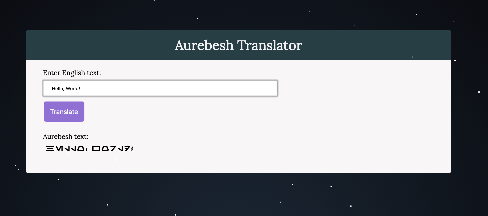

# Aurebesh Translator

"Aurebesh is a writing system used to transcribe Galactic Basic, one of the most used languages in the Star Wars Universe."

## Preview

## Usage

To utilize the translator, please visit [this](https://web.cs.dal.ca/~peachey/aurebesh) link.

## Technical Details

This page was a one day project made due to me catching a serious Star Wars bug during the release of "The Rise of Skywalker" in December 2019.

This project was built with:
* Html
* Css
* Vanilla Js
* Loading Icon - [Loading.io](https://loading.io/css/)
* Parallax Stars - [CodeMyUI](https://codemyui.com/parallax-pixel-stars-using-pure-css/)

## Acknowledgements

Thank you to the developers that provided the resources I used to implment this project!